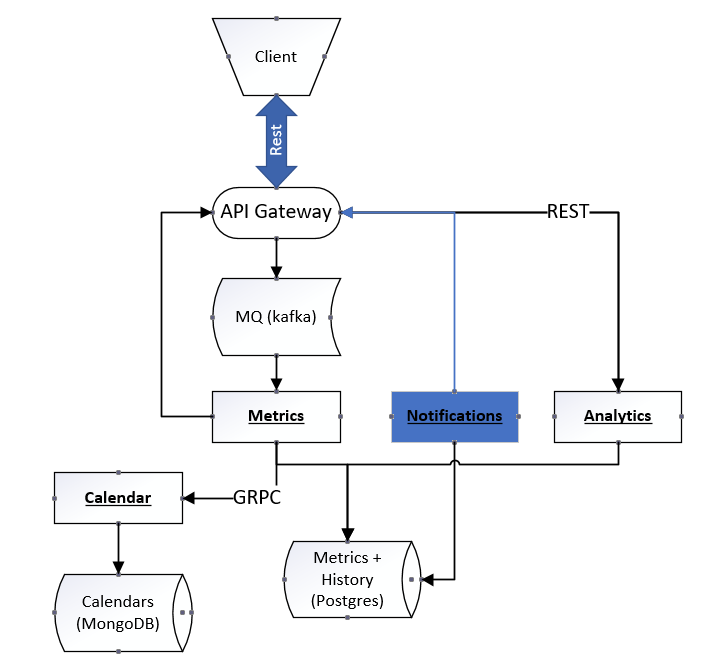
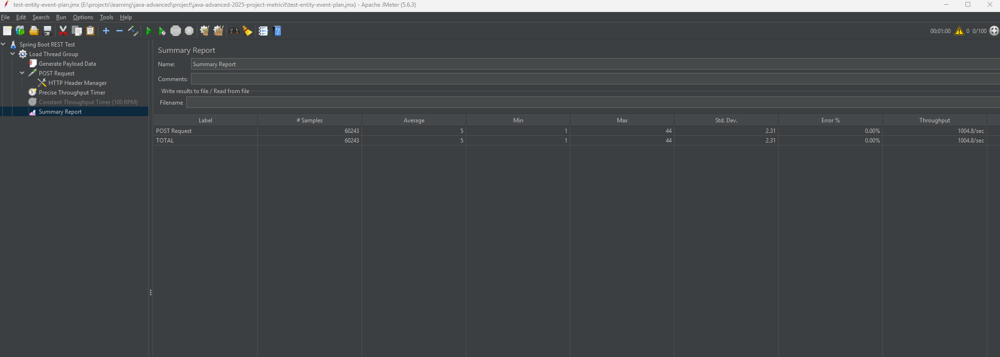
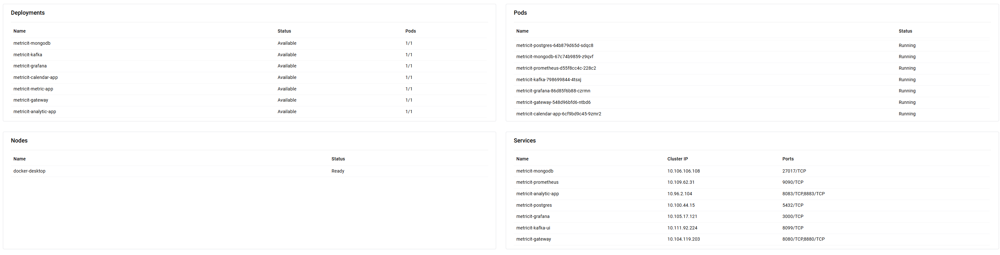
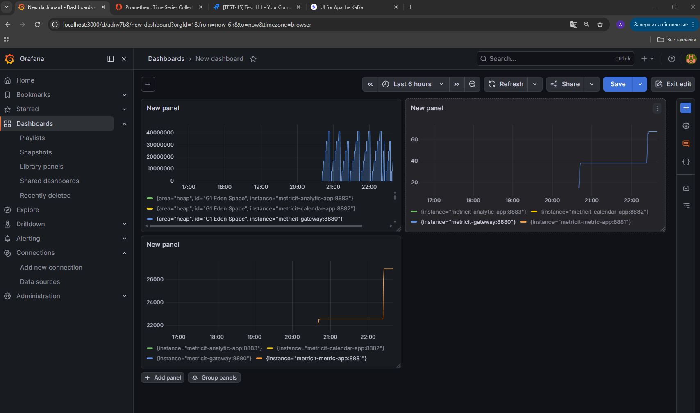
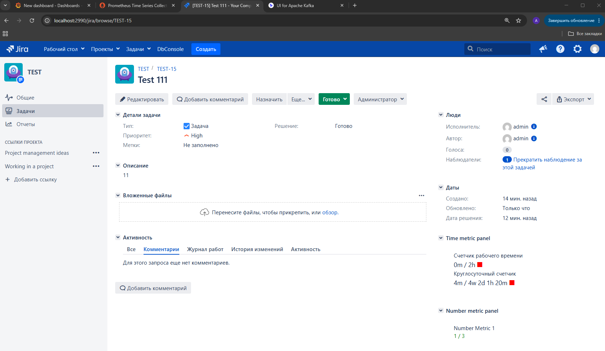
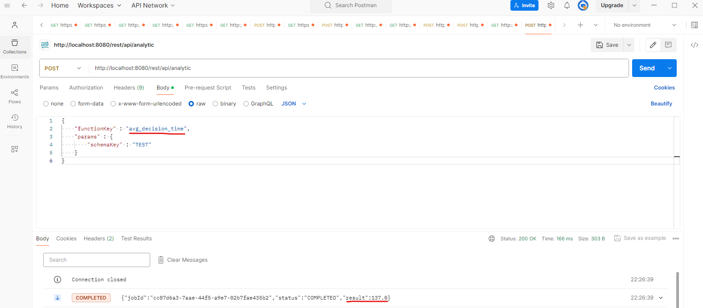

## Сервис временных, количественных и других метрик, а так же построение аналитиики по метрикам и уведомления. Рабочее название "MetricIt!"
### Предназначение сервиса
Сервис предназначен для добавления отслеживания временных, количественных и других показателей к системам, в которых изначально отсутствует этот функционал.
Например, с помощью сервиса можно добавить временные метрики к задачам в таск-трекерах (Jira, Trello и др.) для отслеживания времени, потраченное на выполнение задач на разных этапах ее решения,
либо добавить количественные метрики для отслеживания показателей вида "сколько раз задача была возвращена в работу заказчиком".
При этом основным требованием к сервису является его легкая интеграция в существующие системы с помощью вызова REST-вебхуков с передачей минимального кол-ва информации по задаче (или иной сущности, по которой считаются метрики)
### User-case сервиса
1. Администратор сервиса создает метрику "Время решения заявки", добавляет два metric condition: 
   * если статус заявки = "В работе", счетчик запускается (status=START), и начинает отсчет времени с 0 (actualTime = 0)
   * если статус заявки = "Выполнено", счетчик останавливается (status=STOP)
2. Администратор Jira настраивает веб-хук: при создании\обновлении заявки отправлять ключ заявки, время события и значения основных полей: статус, приоритет, тип и т.д. 
3. Пользователь Jira создает заявку, и затем переводит ее в статус "В работе", в этот момент выполняется веб-хук и событие отправляется в сервис
4. Gateway получает событие, помещает его в Kafka, и возвращает ответ пользователю Accepted
5. Модуль metrics получает сообщение из очереди, находит метрику, выполняет ее правила (с помощью graalVM polyglot). В данном случае сработает первое правило, и счетчик запустится
6. Далее, через какое-то время пользователь переводит заявку в Jira в статус "Выполнено". Metrics так же получает это сообщение, выполняется второе правило.
7. При остановке счетчика нужно посчитать кол-во рабочего времени, которое по нему прошло, с учетом производственного календаря и рабочих периодов.   
   Для этого выполняется запрос в модуль Calendar для рассчета времени, результат записывается в счетчик
8. В БД сохраняется счетчик с посчитанным временем работы, а так же его история
9. Каждый раз, когда пользователь открывает заявку в Jira, выполняется запрос в сервис на получение метрик, которые ведутся по этой заявке
10. Так же пользователи могут запросить аналитику по счетчикам и их истории. Например: посчитать среднее время решения заявок, или посчитать время решения заявок в 99% персентиле и т.д.
### Функционал сервиса:
* настройка и ведение временных, количественных и контекстных метрик с привязкой к, включая сохранение истории по каждой метрики
* аналитика и сбор данных по метрикам. например, "сколько времени задача была на статусе Х"
* уведомления при достижении метрик критических показателей
* для временных метрик должна быть возможность задать расписание с учетом производственного календаря
### Описание общей схемы работы сервиса:
* Приложение-клиент отправляет REST-запрос об измении состояния объекта, к которому привязаны метрики (например, задачи)
* API Gateway принимает запрос, проводит валидацию и регистрирует сообщение в очереди на оработку сервисом metrics, отправляя клиенту ответ, что его запрос принят (204)
* Сервис metrics читает сообщения из очереди и обрабатывает метрики в зависимости от настроек, обновляя их в БД, а так же ведет историю изменения метрик
* Сервис analytics содержит аггрегатные функции для анализа показателей метрик, с возможностью добавления новых функций. Например, функция "сколько задач было решено вовремя (прошедшее время по метрике не превысило ее норматив)"
* Сервис productionCalendar позволяет задавать производственный календарь с учетом выходных и сокращенных дней для корректного посчета по временным метрикам с учетом рабочего дня и рабочих периодов
* Сервис notifications позволяет формировать уведомления о счетчиках, которые приближаются к своим критическим показаниям или превысили их. Уведомления могут настраиваться клиентом
### Визуальная схема приложения

### Описание модулей и примененных в них технологиях и фреймворках:
1. API Gateway - реализован с использованием spring web flux. Причины: минимум логики (отправка сообщений в Kafka и пару REST-запросов за аналитикой и счетчикам), максимально быстрый ответ пользователю
2. MQ Kafka - брокер сообщений, в котором регистрируются все входящие сообщения изменения entity от клиентов
3. Metrics - модуль, который читает сообщения об изменении entity, создает\обновляет метрики, связанные с entity, и ведет историю метрик. БД: postgres
   Правила метрик хранятся в виде JS\GROOVY скриптов и выполняются с помощью GraalVM polyglot
4. Calendar - модуль, в котором хранятся производственные календари по годам. 
   Поддерживает запросы по grpc для более быстрых рассчетов, в качестве БД используется MongoDB для более удобного хранения календарей
   Так же в модуле реализован кеш календарей с использованием SoftReference
5. Noitifications (пока не реализован) - модуль уведомлений. Администраторы сервиса могут настроить уведомления по счетчикам, которые будут приходить клиентам.
   Например: отправлять письмо клиенту, когда счетчик активен и исчерпал свое время работы на 90%. Работает на той же БД, что и metrics
6. Analytics - модуль аналитики. В нем находятся аналитические функции, которые собирают и обрабатывают данные по метрикам и их истории
7. Jira plugin для демонстрации функционала метрик в заявках

Сервис реализован как maven-проект, разбитый на модули: модули api (общие модули, не имеют бизнес-логики) и модули app (исполняемые модули сервиса)  
Настроен deploy проекта в Docker (docker-compose в корне проекта), а так же написан Helm chart для деплоя сервиса в Kubernetes, включая БД, Prometheus и Grafana (с использованием spring actuator)  
В модулях calendar и metric добавлены миграции данных с использованием библиотек mongock и flyway соответственно
#### Проведено небольшое нагрузочное тестирование с помощью Jmeter:

#### Сборка docker-образов (запускаем из корня проекта):
```
docker build -f .\calendar-app\Dockerfile -t metricit/calendar-app:1.0 .     
docker build -f metric-app/Dockerfile -t metricit/metric-app:1.0 .    
docker build -f analytic-app/Dockerfile -t metricit/analytic-app:1.0 .
docker build -f gateway/Dockerfile -t metricit/gateway:1.0 .
```
#### Разворачиваем helm в локальном kubernetes:
```
helm install metricit ./metricit-chart
```
#### Для запуска плагина Jira требуется скачать Atlassian SDK, и затем запустить команды:
```
atlas-mvn clean package
atlas-mvn jira:run
```
Примечание: из личного опыта, сборка плагинов для Jira редко проходит с первого раза гладко, так же бывает зависимость от окружения, в котором идет сборка
#### Рабочий сервис в локальном kubernetes:

#### Настроен базовый мониторинг в Grafana по потреблению памяти, потокам и загруженным классам (из-за выполнения скриптов в runtime):

#### Отображение счетчиков в интерфейсе Jira:

#### Сбор аналитики по метрикам (в данном случае - среднее время решения заявок):
